# linked-data

Load and edit linked data easily


## Usage

### Create Nodes

Let's say we have such nested data:

```js
const cardData = {
  type: 'card',
  theme: 'black',
  children: [
    { type: 'paragraph', children: ['Welcome'] },
    { id: 'openBtn', type: 'button', children: ['Open'] },
  ],
};
```

And we know its pattern (schemas)

```js
const schemas = {
  Component: {
    type: 'object',
    key: 'id', // if exists, take `id` property as unique key
    properties: {
      children: 'ComponentArray', // Array also has its own schema (see below)
    },
  },

  ComponentArray: {
    type: 'array',
    items: 'Component',
  },
};
```

We can convert the data it into lots of connected nodes, following the schema relations.

```js
const linkedData = new LinkedData({ schemas });
const cardNode = linkedData.import(cardData, 'Component');
```

The `linkedData.import()` will follow "Component" schema, explode `cardData` to lots of DataNodes, make links between them, and return the entry DataNode -- the `cardNode` above.

> **Note:**
>
> **Schema does NOT validate value type**. A DataNode with "object" schema, can still storage anything -- array, string, number, etc.
>
> If actual type of `node.value` mismatches, the schema will be ignored temporarily, until value is set to correct type.
>
> In this example, some "Component" nodes store string values only. That's okay.

Every DataNode has a unique key. If you `import` twice without "overwrite" option, you will get new DataNodes. The new nodes will have different keys, although their contents are same as the old nodes'.



### Read, Edit, Link & Unlink

DataNode provides [Proxy](https://developer.mozilla.org/en-US/docs/Web/JavaScript/Reference/Global_Objects/Proxy)-powered `node.value`. You can read, write, splice array, push elements with it freely.

You don't have to care about the links
-- they are automatically converted into Proxy again. Just consume and mutate the value.

```js
const card = cardNode.value;

// you can read and write value to "card"

card.theme = 'light';
card.children.push('another text');

const button = card.children.find(child => child.id === 'openBtn');
button.children.push({ type: 'icon', icon: 'caret-right' });

// card is modified now
```

Because we've prepared schemas for each DataNode, the `*.children.push` above, will automatically:

1. create new "Component" DataNode
2. modify the array, add new link

If you want to manually create a link, use `anotherNode.ref`:

```js
// create a DataNode with no Schema
const passwordNode = linkedData.import('dolphins');

// make a link
cardNode.value.password = passwordNode.ref;

// read
console.log(cardNode.value.password); // => "dolphins"

// always synced
passwordNode.value = 'nE7jA%5m';
console.log(cardNode.value.password); // => "nE7jA%5m"

// unlink
cardNode.value.password = 'dead string';
console.log(cardNode.value.password); // => "dead string"
console.log(passwordNode.value); // => "nE7jA%5m" -- not affected
```

## Track Mutations, Undo & Redo

> This feature is tree-shakable

With **ModificationObserver** magic, all you need is:

```js
import { ModificationObserver } from 'linked-data';

// ... skip ...

const observer = new ModificationObserver(() => {
  // find out what's changed
  const records = observer.takeRecords();
  console.log(`You just add / edit ${records.length} nodes!`);

  // you can storage records to somewhere else.
  // how to undo/redo? see the first figure above

  // stop observing
  observer.disconnect();
});

// start observing
observer.observeLinkedData(linkedData);

// ----------------------------------------
// now start to modify node.value
// ...

const card = cardNode.value;

card.theme = 'light';
card.children.push('another text');

const button = card.children.find(child => child.id === 'openBtn');
button.children.push({ type: 'icon', icon: 'caret-right' });
```

In the `records`, you may get following deduced procedure:


With the records, you can easily implement undo & redo:

```js
import { applyPatches } from 'linked-data';

// undo:
records.forEach(record => {
  record.node.value = applyPatches(record.node.value, record.revertPatches);
});

// then, redo:
records.forEach(record => {
  record.node.value = applyPatches(record.node.value, record.patches);
});
```

## Theories

### Mutable & Immutable

In the separated _Node_ list, every node is independent.
If you modify a _Node_, the other *Node*s referring it will NOT be mutated
-- they only have a _reference_, not a _value_.

Therefore, the nested data containing lots of *Node*s, is close to "**mutable**" philosophy.

We only cares about when a _Node_'s value changes. You can maintain in **mutable** way or **immutable** way
-- it doesn't matter, as long as you can notify us that value is changed.

💡 We suggest that maintain _Node value_ in **immutable** way.
It allows external libraries to utilize `Object.is(x, y)` and low-costly distinguish whether _value_ is really changed,
where _value_ can be the whole Node or some property from Node.

<details>

<summary>💭 Some thoughts and facts</summary>

- To be aggressive, if we treat every object/array as _Node_ regardless of their semantic purposes,
  we will get Vue or Mobx -- every non-primitive value can be "observed".

- Web Component's attributes are always primitive data, which makes the comparison simple and low-cost.

</details>

### Dependency Graph

Every Node can be referred.

It's easy to find out a Node's dependents with _linked-data_ because we collects necessary info while generating the separated Node list.

The dependency graph may be circular.

### Identifier

Every Node needs an identifier.

💡 Identifiers shall be **permanent, readonly, final** to a Node.

💡 In a certain context, identifiers shall be **unique**.

We shall _always_ store it within Node's value. If a input Node has no identifier, we shall generated one, in current context.

You can see lots of generated, `unnamed_`-prefixed identifiers in the example above.

<details>

<summary>💭 Some thoughts and facts</summary>

- Vue doesn't need one because

  1. Each object instance has a memory address in JavaScript engine.
     We can use memory address as the identifier because Identifier's properties apply to memory addresses.

  2. Vue doesn't hydrate two nested data.

- MongoDB generates `_id` for each document.

</details>

### When you need Schemas

Schemas are optional.

**Schema does NOT validate value type**. A DataNode with "object" schema, can still storage anything -- array, string, number, etc.

If actual type of `node.value` mismatches, the schema will be ignored temporarily, until value is set to correct type.

What can a schema play a role in? You can define some rules by writing schemas:

- `key`:

  - when importing, how to read Identifier from raw JSON object
  - when exporting, how to write Identifier to the exported JSON object

- `properties` for objects, or `items` for arrays
  - when importing, convert some properties it into a _Node Reference_.
  - when exporting, convert some "referring" properties into node.
  - when writing values (not reference) into certain properties, automatically create new Node and new reference.

However the other properties **CAN** be a _Node Reference_ too -- user can make links anywhere.
